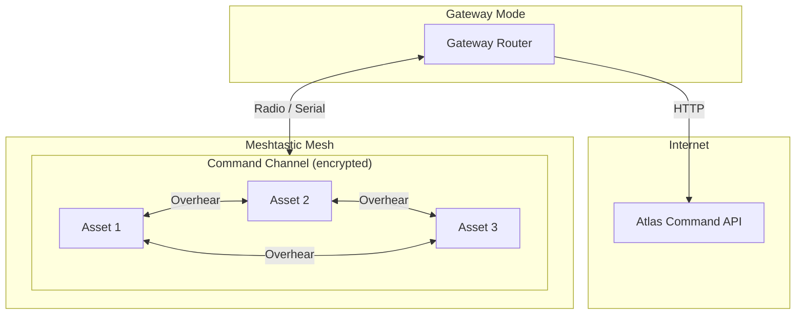
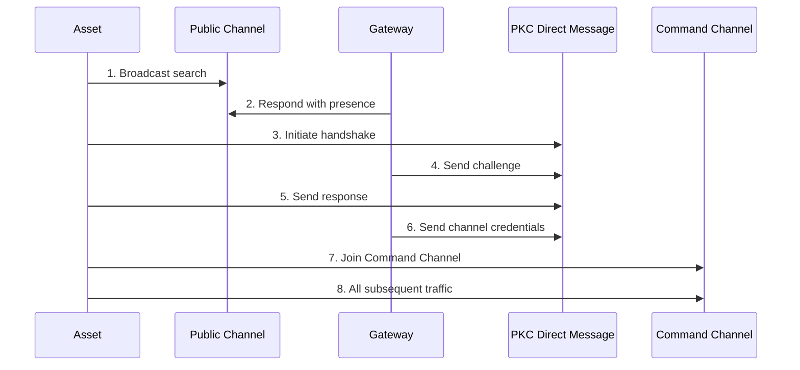
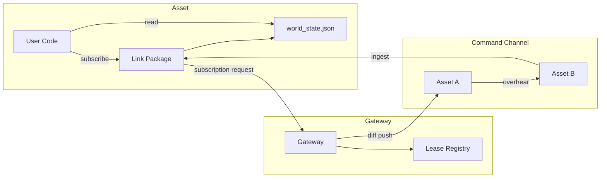

# Architecture Overview

High-level architecture of the dual-mode Meshtastic link: gateway (internet bridge) and asset (edge SDK).

## System Diagram



## Gateway Discovery Flow



## Data Flow (Subscriptions & Overhearing)



## Module Map

```
src/atlas_meshtastic_link/
│
├── __init__.py              # Public API: run(), __version__
├── _link.py                 # Entry point: config → radio → mode runner
│
├── config/                  # LAYER: Configuration (no deps on other layers)
│   ├── schema.py            #   LinkConfig dataclasses + load_config()
│   └── modes/               #   Radio mode profiles (JSON)
│       └── general.json
│
├── transport/               # LAYER: Raw radio I/O (only layer touching serial)
│   ├── interface.py         #   RadioInterface Protocol
│   ├── discovery.py         #   USB auto-discovery via pyserial VID/PID
│   ├── serial_radio.py      #   SerialRadioAdapter (wraps meshtastic SerialInterface)
│   ├── chunking.py          #   Binary 16-byte header chunk/parse protocol
│   └── reassembly.py        #   MessageReassembler: buckets, TTL, gap detection
│
├── protocol/                # LAYER: Wire format + reliability (no radio specifics)
│   ├── envelope.py          #   MessageEnvelope: msgpack + zstd encode/decode
│   ├── reliability.py       #   ReliabilityStrategy Protocol + windowed impl
│   ├── dedup.py             #   RequestDeduper
│   └── spool.py             #   PersistentSpool: disk-backed durable queue
│
├── state/                   # LAYER: Shared state (used by both gateway & asset)
│   ├── world_state.py       #   WorldStateStore: in-memory dict + atomic JSON flush
│   ├── subscriptions.py     #   LeaseRegistry: TTL-based subscription tracking
│   └── overhearing.py       #   OverhearingFilter: passive ingest routing
│
├── gateway/                 # LAYER: Gateway mode (depends on protocol/, state/)
│   ├── router.py            #   GatewayRouter: receive → dispatch → reply
│   ├── http_bridge.py       #   AtlasHttpBridge: async HTTP to Atlas Command API
│   ├── lease_registry.py    #   Per-asset subscription lease management
│   └── operations/          #   Pluggable async operation handlers
│       └── __init__.py
│
└── asset/                   # LAYER: Asset mode (depends on protocol/, state/)
    ├── runner.py            #   AssetRunner: main asset event loop
    ├── edge_client.py       #   EdgeClient: typed API for user code
    ├── provisioning.py      #   ProvisioningHandshake: gateway discovery state machine
    └── sync.py              #   AssetSync: ingest diffs → update WorldState
```

## Layer Dependencies

```
config/  ←── (no deps)
transport/ ←── config/
protocol/ ←── (standalone, knows MessageEnvelope)
state/ ←── (standalone)
gateway/ ←── protocol/, state/, transport/
asset/ ←── protocol/, state/, transport/
_link.py ←── all layers
```

## Key Concepts

- **Gateway:** Internet-connected bridge. Talks to Atlas Command over HTTP and to assets over the mesh.
- **Asset:** Edge node. Maintains local `world_state.json`, subscribes to entities, and can overhear traffic addressed to others.
- **Command Channel:** Shared encrypted channel. All post-provisioning traffic flows here.
- **Discovery:** Happens on public channel + PKC DM; credentials never broadcast. See [GATEWAY_DISCOVERY.md](GATEWAY_DISCOVERY.md).

